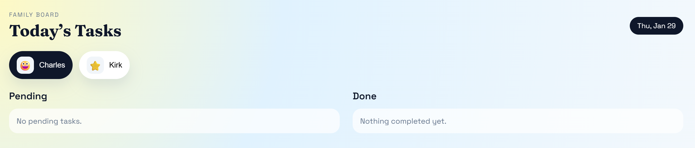
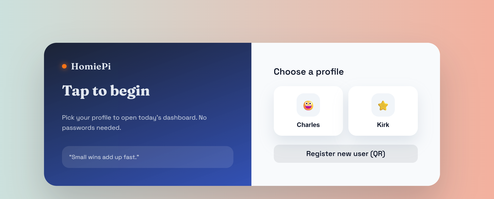

# HomiePi

<p align="center">
  
</p>

<p align="center">
  Local-network family kiosk for daily task check-ins. Touch-first, no typing, no passwords.
</p>

<p align="center">
  <a href="#quick-start">Quick Start</a> ·
  <a href="#how-it-works">How It Works</a> ·
  <a href="#features">Features</a> ·
  <a href="#project-structure">Project Structure</a> ·
  <a href="#roadmap">Roadmap</a>
</p>

English | [简体中文](./README.zh-CN.md)

## Overview

HomiePi turns a Raspberry Pi (or any home server) plus a screen into a family task board. Add users and
tasks from any phone on the same Wi-Fi via QR codes, then tap to complete tasks on the kiosk.

## Highlights

- Local-only: runs entirely on your LAN
- Touch-first kiosk UI designed for a wall tablet or Pi display
- QR flows for adding users and tasks (no keyboard required)
- Multi-user avatars and daily check-ins

<p align="center">
  
</p>
<p align="center">
  Dashboard: today’s tasks with pending/done columns and user pills.
</p>
<p align="center">
  
</p>
<p align="center">
  Home page: tap a profile to enter the kiosk, or register via QR.
</p>

## Quick Start

Prereqs: Python + pip. Node.js is only needed if you want to rebuild the frontend.

### 1) Backend
```
cd backend
python -m venv .venv
source .venv/bin/activate
pip install -r ../requirements.txt
python manage.py migrate
python manage.py runserver 0.0.0.0:8000
```

### 2) Frontend build (only if you change frontend code)
```
cd backend/frontend
npm install
NODE_OPTIONS=--openssl-legacy-provider npm run build
```

### 3) Open the kiosk
```
http://<pi-ip>:8000/
```

## How It Works

1. The kiosk shows a user picker and a daily checklist.
2. On a phone: open `http://<pi-ip>:8000/add_new_user` to add a user via QR.
3. On a phone: open `http://<pi-ip>:8000/add_new_task` to add tasks via QR.
4. Tap tasks on the kiosk to complete daily check-ins.

## Features

- Touch-friendly kiosk dashboard
- QR-based user registration (no passwords)
- QR-based task creation and scheduling
- Daily tap-to-complete records
- Multi-user avatars

## Tech Stack

- Backend: Django + Django REST Framework
- Frontend: React
- QR generation: qrcode

## Project Structure

- `backend/` Django project root (contains `manage.py`)
- `backend/API/` backend models and views
- `backend/frontend/` React source + build tooling
- `backend/frontend/static/frontend/main.js` compiled frontend bundle

## Roadmap

- Task edit/delete
- History/statistics
- Offline QR generation (no external CDN)
